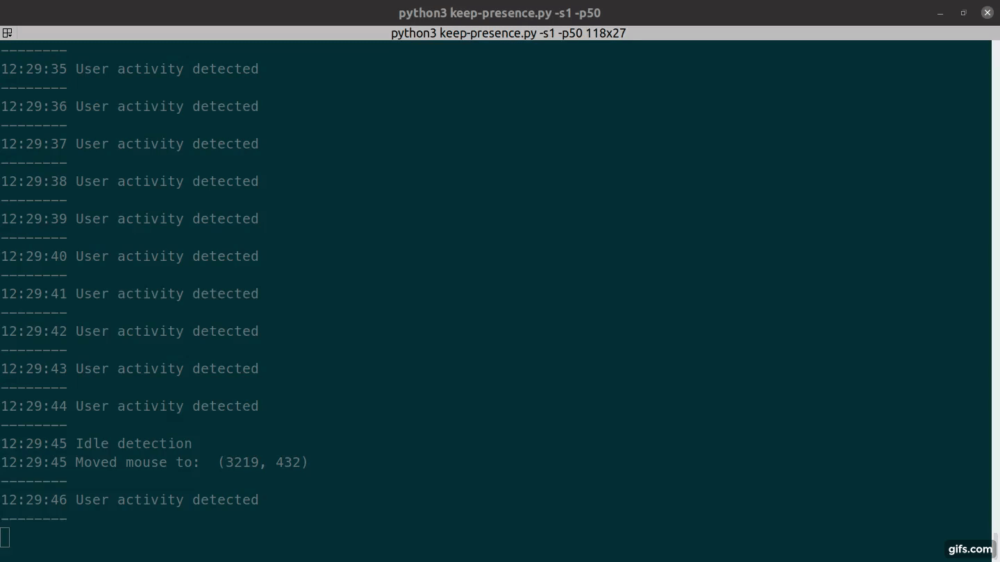

# Keep Presence

This program moves the mouse or press a key when it detects that you are away.  
It won't do anything if you are using your computer.  
Useful to trick your machine to think you are still working with it. 

## Demo

[](https://github.com/carrot69/keep-presence)

## Install with Snap

```
sudo snap install keep-presence
```

##### Run

```
keep-presence
```

If you don't have the `snap` command available, you might be able to find instructions for your distro [here](https://docs.snapcraft.io/core/install).

## Classical installation

- Clone the project
- Install `python3` and `pip3`.
- Execute `pip3 install pynput`

##### Run

```
python3 keep-presence.py
```

### Command arguments

- `python3 keep-presence.py --seconds 300`. Default is `300` seconds. This define in seconds the allowed idle time. After that time, if mouse wasn't moved, it will move the mouse or press the shift key on the keyboard.
- `python3 keep-presence.py --mode mouse`. Default is `mouse`. Modes allowed are `mouse` | `keyboard` | `both`. After away is detected, what action is needed? Move the mouse 1 pixel, press the shift key or both. 
- `python3 keep-presence.py --pixels`. Default is `1`. Define how many pixels the mouse should move if user is away. 
